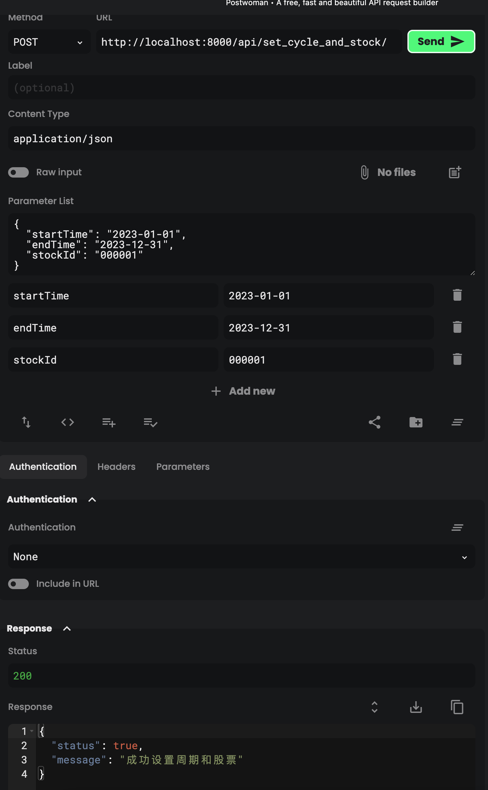
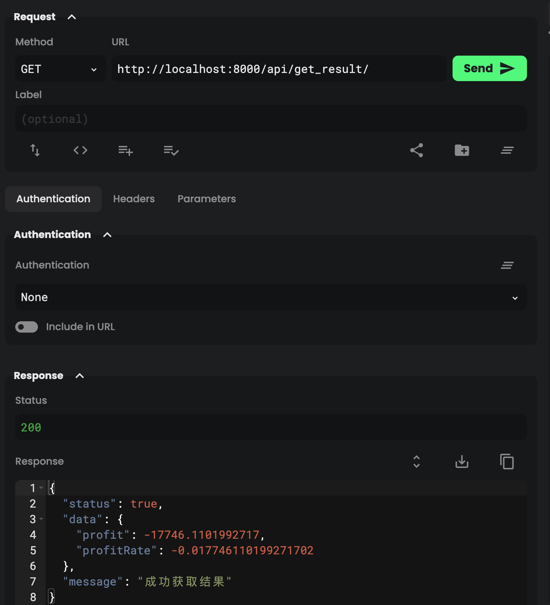
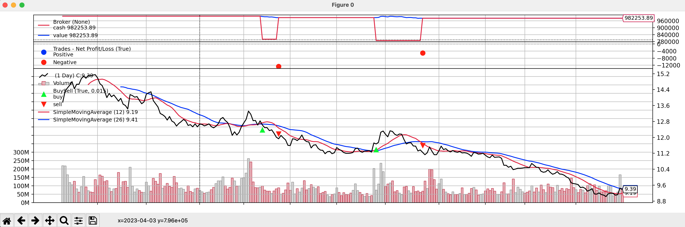

# bridge_test
如果你不想按照我们的要求做而是想搭建一些更有趣的策略，我们十分欢迎！我们渴望看到你的创造力，你可以随时向我们的邮箱发送你的代码 litterpigger@gmail.com

如果你使用AI来帮助你完成答题，请你在该文件夹下新建一个名为prompt.txt的文件，并将你们的对话放入。如何正确的使用prompt与ai交互也是能力之一，使用ai不会对你的成绩有任何消极影响。

使用AI却不按上面这么做我们则会直接取消你的成绩。


[前置]

回测框架你可以自行搭建，也可以使用vnpy或backtrader等常用的回测框架

通过tushare sdk可以帮助你更方便的获取股票数据。你也可以自行下载数据。

https://tushare.pro/document/1?doc_id=7

https://tushare.pro/document/2

https://tushare.pro/document/1?doc_id=131

后端的框架请自行挑选，你可以自由的使用pip中所有的库


[要求]

你需要首先fork这个代码仓库到你的github,然后完成开发后提交到你的github上面，最后只需要发你的github代码仓库连接给我们就可以


1. 回测品类为平安银行，回测周期为2023年1月1日到12月31日。本金为1,000,000,每次买入为本金的百分之20.滑点为万分之一。 


2. 策略为当12日的价格均线穿越26日的价格均线时买入。当价格跌破26均线时卖出。你需要在backtest文件夹下完成策略的回测，并即将为后端提供结果


3. 你可以使用任意的python后端框架。你所需要实现的api: 第一个为post方法，为设置周期以及对应回测的股票。第二个为get方法，将该策略回测的结果的收益率,最后的总权益返回。


4.最后你需要在README.md中说明你的api使用方法，方便我们进行测试。


[结果]

## API使用方法
### 后端运行
安装依赖
```shell
pip install djangorestframework django backtrader
```
运行后端
```shell
python manage.py runserver 0.0.0.0:8000
```
### API使用
#### 设置周期以及对应回测的股票
url: `http://localhost:8000/api/set_cycle_and_stock/`
method: `POST`
data: 
```json
{
    "startTime": "2023-01-01",
    "endTime": "2023-12-31",
    "stockId": "000001,
}
```


#### 获取策略回测的结果
url: `http://localhost:8000/api/get_result/`
method: `GET`
data: 
```json
{
    "profit": 0.1,
    "total_equity": 1100000
}
```


### 策略回测结果
策略代码
```python
        # 买入条件：当12日的价格均线穿越(>)26日的价格均线时买入。
        if self.m1[0] > self.m2[0] and self.m1[-1] < self.m2[-1]:  
            if size > 0:
                self.log('BUY, %.2f' % size)
                self.log('Close, %.2f' % self.dataclose[0]) 
                self.order = self.buy(size=size)  # 买入
                self.log(f"12日均线：{self.m1[0]}，26日均线：{self.m2[0]}")
        

        # 卖出条件：当价格跌破26均线时卖出。
        if self.m1[0] < self.m2[0] and self.m1[-1] > self.m2[-1]:  
            if size > 0 and self.position.size > size:
                self.log('SELL, %.2f' % size)
                self.log('Close, %.2f' % self.dataclose[0]) 
                self.order = self.sell(size=size)  # 卖出
            elif self.position.size > 0:
                self.log('SELL, %.2f' % self.position.size)
                self.log('Close, %.2f' % self.dataclose[0]) 
                self.order = self.sell(size=self.position.size)
            self.log(f"12日均线：{self.m1[0]}，26日均线：{self.m2[0]}")
        # self.log(f"持仓：{self.position.size}")
```
回测结果(图像显示)


### 备注
- 本项目使用Django作为后端框架，使用backtrader作为回测框架
- tushare由于新账户积分不够，所以无法使用，所以使用了本地数据，也就暂时无法实现指定股票的回测
- AI部分的对话在prompt.txt中